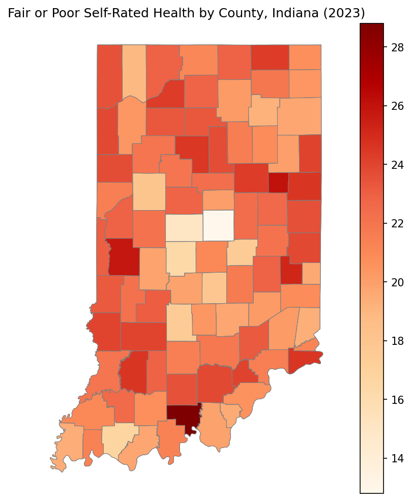

# Poverty as a Signal for County-Level Health Outcomes in Indiana

## Overview

**The question:** Do county-level economic and structural conditions — poverty rate chief among them — predict health outcomes across Indiana, and *how much* of the variation in outcomes like diagnosed diabetes, fair/poor self-rated health, and frequent mental distress can they actually explain?

**Why it matters:** If economic disadvantage is a measurable driver of population health, that's a lever policymakers can pull. A state health department or a population-health organization like Regenstrief could use this to treat economic barriers as a health intervention point rather than a separate social issue — justifying models like income-scaled clinic pricing, low-upfront-cost clinics, or more lenient SNAP access in struggling communities so that essential care and nutrition don't price out the people who need them most.

---

## Data

The analysis joins two public datasets at the county level across all 92 Indiana counties.

**Predictors — U.S. Census American Community Survey (ACS), 2023.** The ACS supplies the economic and structural side of the model: county poverty rate, elderly share of population, and labor-force participation. These describe the *conditions* a county's residents live under.

**Outcomes — CDC PLACES, 2023.** PLACES supplies the health side: county-level prevalence of three adult health outcomes. These are the things being predicted.

The two sources were merged on 5-digit county FIPS codes. ACS arrives keyed by county name, so a FIPS crosswalk was used to attach codes before the join, and both keys were normalized to zero-padded 5-digit strings to ensure a clean match. The deliberate split — ACS for predictors, PLACES for outcomes — keeps the economic signal and the health signal in separate datasets, avoiding the circularity that would arise from predicting health using variables that are themselves health-adjacent.

---

## Methods

**Predictors.** I used three county-level predictors, anchored on **poverty rate** as the primary signal of economic disadvantage. I added **elderly share** because age structure shapes county health independently of income — older populations carry more chronic disease — so it gives a more nuanced read than poverty alone. I included **labor-force participation** as a proxy for economic access and engagement: two equally-poor counties tell different stories if one has high workforce participation and the other doesn't, the latter suggesting deeper structural barriers.

**Outcomes.** I modeled three health outcomes rather than one, chosen to span different relationships to poverty. **Fair or poor self-rated health** is a broad, validated summary measure of overall health. **Diagnosed diabetes** is a concrete chronic condition with a well-established link to poverty in the public-health literature. **Frequent mental distress** was included as an exploratory outcome — less directly tied to material conditions, and the one I was most curious about.

**Validation.** With only 92 counties, a single train/test split would leave roughly 18 counties in the test set, making the result highly sensitive to which counties happened to land there. I used **5-fold cross-validation** instead: the data is divided into five parts, and the model trains five times, each time holding out a different fifth as the test set. Averaging across folds gives a far more stable performance estimate than any single split.

**Crude vs. age-adjusted prevalence.** I used crude prevalence rather than age-adjusted. Age-adjustment would strip age out of the outcome — which would waste the elderly-share predictor I deliberately included to let age do explanatory work. Crude outcomes keep age in the picture, so elderly share earns its place in the model.

**A path I dropped.** I originally planned to break poverty into bands — from deep poverty to comfortable — by share of each county's population. On inspection, those columns were empty in the source table, so I dropped the band scheme and kept the single poverty rate as the economic signal. The simpler predictor was also the more defensible one given the sample size.

---

## Results

Poverty and its structural companions predicted all three outcomes at a **moderate level (R² ≈ 0.49–0.57)**, explaining roughly half the county-to-county variation in each. Fold-to-fold variation was **low** (std 0.05–0.12), so despite the small 92-county sample, the estimates were stable across folds rather than swinging on a handful of counties.

| Outcome | CV R² | Std |
|---|---|---|
| Diagnosed diabetes | 0.57 | 0.10 |
| Frequent mental distress | 0.54 | 0.05 |
| Fair or poor self-rated health | 0.49 | 0.12 |

**Diagnosed diabetes was the strongest (R² 0.57).** This fits a large body of public-health literature linking poverty to diabetes burden. The 43% the model doesn't explain may partly reflect *measurement* rather than other causes: in counties with weak diagnostic access, undiagnosed cases get recorded as absence of disease, so the true poverty–diabetes link may be even tighter than the data can show.

**Frequent mental distress came next (R² 0.54) and was the most stable outcome** (lowest variance by a clear margin). Economic strain is a well-established driver of mental distress, and because the measure is self-reported, it doesn't pass through a diagnostic gate the way diabetes does — economic hardship surfaces in the response regardless of whether anyone saw a clinician. That may be why poverty tracks it so consistently. The ~46% left unexplained reflects that mental distress, while strongly economic, has many other contributing causes.

**Fair or poor self-rated health was the weakest of the three (R² 0.49).** One plausible mechanism: people in economically strained communities often delay seeking care until a condition becomes critical, so self-perceived health can lag behind actual economic circumstances, loosening the link the model can detect.

**What the map added.** The regression quantifies *how much* poverty explains; the choropleth shows *where*. Mapping fair/poor self-rated health across Indiana's 92 counties reveals spatial clustering the regression can't — the central counties show the lowest rates of fair/poor health, and those same counties are the more urban Indianapolis-metro areas where healthcare access is greatest. The two methods tell the same story in complementary registers: one numeric, one geographic.

---

## Limitations

**Small sample.** 92 counties is a small dataset for regression. Cross-validation kept the estimates stable (low fold-to-fold variance), but a larger sample would still allow more predictors and more confident inference.

**Data reflects the system that produces it.** As the diabetes result suggests, health prevalence figures depend on diagnosis and reporting, which depend on access. Outcomes that require a clinical encounter may be undercounted exactly where access is poorest — so the data can understate disease burden in the most disadvantaged counties.

**Denominator approximations.** Labor-force participation was computed against the prime working-age (18–64) population, and the poverty denominator follows the Census "population for whom poverty status is determined," which excludes certain groups. These are reasonable proxies but not exact.

With more time, I would extend the analysis to all U.S. counties — adding state-level context and a far larger sample would let the poverty–health relationship be tested across more varied economic settings than a single state allows.

---

## Implications

This analysis points to a few actionable directions for a health-policy audience:

**Concentrate diabetes prevention and services in poor counties.** Since diabetes showed the strongest poverty link, the health department could focus clinics and free public-health services in economically challenged communities — paired with prevention campaigns on nutrition and expanded SNAP access, so residents can afford the nutritious food that lowers diabetes risk. (The analysis links poverty to diabetes prevalence; improving food access is a plausible lever on that burden, not a guaranteed fix.)

**Build diagnostic access where the data goes quiet.** The unexplained share of diabetes may partly be undiagnosed cases in low-access counties. Mobile clinics and low-barrier screening in hard-to-reach areas would serve those populations *and* close the data blind spot that currently hides their true burden.

**Address the underlying economic barrier.** Across all three outcomes the common thread is economic. More lenient healthcare-coverage eligibility for disadvantaged communities tackles the root rather than the symptom — the structural condition all three outcomes trace back to.

---

## Stack

Python · pandas · scikit-learn (LinearRegression, 5-fold cross-validation) · geopandas · matplotlib · Census ACS & CDC PLACES data · county-level FIPS merge
